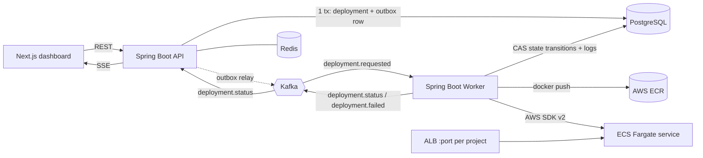
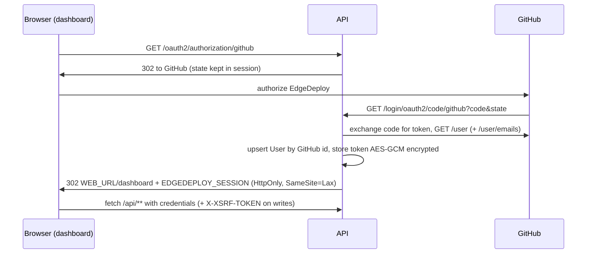

# EdgeDeploy

**A self-hosted, Vercel/Render-style deployment platform.** Sign in with GitHub, pick a repository, click
**Deploy**, and EdgeDeploy builds the exact commit into a Docker image, pushes it to **Amazon ECR**, rolls it out on
**ECS Fargate** behind an **Application Load Balancer**, health-checks it and hands back a live URL, streaming every
step to the dashboard in real time.


## Demo

A full deployment, from a GitHub repository to a running application on AWS ECS Fargate: the live build log, the
deployment timeline, the health check, **Open Application**, and the AWS resources it creates.

https://github.com/user-attachments/assets/9cdcccd1-274d-428d-ac1f-a0d4e85e7087

### Screenshots

| | |
|:---:|:---:|
| <br>**Sign in with GitHub**: OAuth, server-side sessions in Redis, the GitHub token encrypted at rest | <br>**Dashboard**: projects and recent deployments across them |
| <br>**Pick a repository**: your GitHub repositories, with write access checked | <br>**Create a project**: branch, framework (auto-detected) and optional build/start commands |
| <br>**Project page**: status, production URL, deployment history, settings and encrypted environment variables | <br>**Live build**: step timeline and build output streamed over Server-Sent Events |
| <br>**Running on AWS**: Queued → Building → Pushing → Deploying → Health check → Running | <br>**Open Application**: the deployed app served through the load balancer |
| <br>**After deploying**: live project with its URL and deployment history | |

## Highlights

- **Git push to live URL**: clones and verifies the *exact* commit, detects the framework (Next.js, Vite, Create React
  App, Node.js; npm, pnpm or Yarn), generates a hardened multi-stage Dockerfile and builds it.
- **Real AWS deployment**: per-project ECR repository, ECS Fargate service, task definition pinned to the image
  digest, ALB target group and listener, CloudWatch logs; health-checked before it is marked live, with automatic
  rollback to the previous version if a release fails.
- **Event-driven and reliable**: transactional outbox → Kafka → worker, idempotent consumers, compare-and-set state
  machine shared by API and worker, dead-letter topic, reaper for deployments abandoned by a crashed worker.
- **Live feedback**: deployment status and logs stream to the browser over Server-Sent Events, resumable after reconnects.
- **Security by default**: GitHub OAuth with Redis sessions and CSRF protection, AES-256-GCM encrypted tokens and
  environment variables (stored as SSM SecureStrings on AWS, never logged or returned by the API), least-privilege
  IAM, untrusted repository code kept away from the worker's secrets.
- **Cost-aware infrastructure**: one CloudFormation stack with no NAT gateway, a **budget mode** that runs without a
  load balancer on Fargate Spot, and a cleanup script that removes everything.
- **Tested**: 200+ unit and integration tests (JUnit 5, Mockito, Testcontainers), with AWS calls tested against mocked SDK clients.

## Tech stack

| Layer | Technology |
|-------|------------|
| Dashboard | Next.js 15, React 19, TypeScript, Tailwind CSS |
| API | Java 21, Spring Boot 3.5, Spring Security (OAuth2), Spring Data JPA, Flyway, springdoc OpenAPI |
| Worker | Java 21, Spring Boot, Spring Kafka, git and Docker CLIs, AWS SDK for Java v2 |
| Data and messaging | PostgreSQL 16, Apache Kafka 3.9 (KRaft), Redis 7 |
| Cloud | Amazon ECR, ECS Fargate (and Fargate Spot), Application Load Balancer, CloudWatch Logs, SSM Parameter Store, IAM, CloudFormation |

## Status

Phase 4 (AWS ECR + ECS Fargate) is complete. Without AWS configured (`EDGEDEPLOY_AWS_ENABLED=false`, the default),
deployments build the image locally and stop at **`IMAGE_BUILT`**, so the whole platform can run on a laptop. AWS setup,
IAM, **costs** and cleanup: [docs/aws-setup.md](docs/aws-setup.md).

## Architecture



| Component | Responsibility |
|-----------|----------------|
| `apps/web` | Next.js 15 + Tailwind dashboard: GitHub sign-in, repository/branch picker, projects, deployments, live timeline (SSE) |
| `apps/api` | GitHub OAuth + sessions, GitHub REST client, REST API, validation, persistence, **transactional outbox**, SSE fan-out. Owns the DB schema (Flyway). Never runs long operations. |
| `apps/worker` | Build engine. Consumes `deployment.requested` and runs `DeploymentPipeline`: `GitService` → `FrameworkDetector` → `DockerfileGenerator` → `DockerBuildService` → `ContainerRegistryService` (ECR, or local) → `DeploymentTargetService` (ECS Fargate + ALB, or none). The pipeline never calls the AWS SDK: `AwsEcrService`/`AwsEcsService` sit behind those interfaces. All logs go through `DeploymentLogService`, all status changes through `DeploymentStatusService`. |
| `libs/contracts` | Framework-free Kafka event records, topic names and the `DeploymentStatus` state machine shared by api and worker. |

### Authentication



- **Server-side sessions in Redis** (Spring Session) rather than JWTs: revocable on logout, shared across API instances, nothing token-like in browser storage. The session principal holds only the user id, login, name and avatar.
- **GitHub token never reaches the browser.** It is encrypted with AES-256-GCM (`SecretCipher`, bound to the user id) in `github_credentials`, behind a `GitHubTokenStore` interface so it can move to a secrets manager later. Spring's default authorized-client store is replaced with one that keeps nothing.
- **CSRF**: Spring Security's cookie-to-header pattern (`XSRF-TOKEN` cookie → `X-XSRF-TOKEN` header) on every mutating request, on top of SameSite=Lax cookies and an explicit CORS origin allow-list.
- **Ownership**: the current user always comes from the session principal; every project/deployment query is scoped by it, and another user's resources answer 404.
- `/api/**` answers 401/403 as ProblemDetail (never redirects). A revoked GitHub token yields 401 with `code: github_reauth_required`.

### Deployment flow

1. `POST /api/projects/{id}/deployments` resolves the commit on GitHub (requested SHA or branch tip) **outside** any DB transaction, then inserts a `QUEUED` deployment **and** an outbox row in one transaction and returns `202 Accepted` immediately.
2. `OutboxRelay` publishes pending outbox rows to `deployment.requested` (key = deploymentId), using `FOR UPDATE SKIP LOCKED` so multiple API instances can relay safely.
3. The worker **claims** the deployment (`UPDATE … SET status='BUILDING' WHERE id=? AND status='QUEUED'`). The deployment id is the idempotency key: a duplicate or late event finds it in another state and is skipped.
4. In a private workspace (`{tmp}/edgedeploy/{deploymentId}`, always deleted afterwards) the pipeline:
   - **clones** (`git init` + fetch of exactly the requested commit, falling back to the branch history),
   - **checks out and verifies** the commit (`HEAD` must equal the requested SHA),
   - **detects** the framework (Next.js, Vite, Create React App, Node.js) and package manager (npm, pnpm, Yarn),
   - **generates a multi-stage Dockerfile** outside the source tree and runs **`docker build`** → `edgedeploy/{projectId}:{commitSha}`,
   - **local mode**: moves the deployment to **`IMAGE_BUILT`**;
   - **AWS mode**: `PUSHING` (ensure ECR repo `edgedeploy/{projectId}`, `docker push`, resolve the digest) →
     `DEPLOYING` (log group, environment variables as SSM SecureStrings, new task definition revision pinned by digest,
     target group + ALB listener, create/update the ECS service `edgedeploy-{projectId}`, wait until the rollout
     completes) → `HEALTH_CHECK` (ALB target healthy, then an HTTP probe of the public URL) → **`RUNNING`** with the URL;
     the previous RUNNING deployment becomes STOPPED. If anything fails after the service was updated, the previous
     version is restored.
   - any failure → **`FAILED`** with a specific, sanitized reason.
   Each milestone is a step-tagged log line; build output is stored too (capped, tail preserved).
5. Log lines are written to Postgres and published on `deployment.logs` after commit; status changes on `deployment.status`. The API fans both out to browsers over SSE (`/events` for status, `/logs/stream` for logs, resumable via `Last-Event-ID`).

Statuses: `QUEUED → BUILDING → PUSHING → DEPLOYING → HEALTH_CHECK → RUNNING` (local mode: `QUEUED → BUILDING →
IMAGE_BUILT`); any active state `→ FAILED`. Cancel (`→ STOPPED`) is allowed while `QUEUED`, `BUILDING` or `PUSHING`: the
worker polls for `STOPPED` and terminates git/docker. Once the ECS rollout has started it runs to completion or failure.

Deployments of the same project roll out one at a time (Postgres advisory lock), and a deployment that would replace a
newer one already live is skipped. One ECS service, task definition family, target group and listener port per project;
each deployment adds a task definition revision and stores commit, image digest and task definition ARN for rollback.

### Kafka topics

| Topic | Producer → Consumer | Purpose |
|-------|--------------------|---------|
| `deployment.requested` | api (outbox) → worker (`edgedeploy-worker` group) | Command: execute a deployment |
| `deployment.requested.DLT` | worker error handler | Records that failed after retries (exponential backoff) or were malformed (no retry) |
| `deployment.status` | worker → api (one group per api instance) | Notification of a committed state change |
| `deployment.logs` | worker → api (one group per api instance) | Newly persisted log lines (batched), for live log streaming |
| `deployment.failed` | worker → (future: notifications) | Business event: a deployment failed |

### Build security boundary

Building a repository means running its install/build scripts: **untrusted code**. Phase 3 contains it as far as a
single shared Docker daemon allows:

- `GITHUB_DEPLOY_TOKEN` reaches only the `git` process, as an HTTP header via `GIT_CONFIG_*` environment variables:
  never in argv, `.git/config`, Kafka events, API responses or logs (a redactor also masks token-shaped strings).
- git runs with no system/global config, a private `HOME` and no prompts; **symlinks are checked out as plain files**,
  so a repository cannot point the worker at host files. Repository/branch/SHA values are validated and never used as paths.
- The generated Dockerfile lives outside the repository, uses exec-form JSON for every command (user build/start
  commands cannot inject instructions), mounts nothing, passes no build args or secrets; the docker CLI gets a minimal environment.
- Workspaces are per deployment, `0700`, never reused, and deleted without following symlinks.

**This is not sufficient for a multi-tenant production service**: builds share the host's daemon, kernel, cache and
network. Production needs isolated builders (rootless BuildKit or Kaniko in per-build gVisor/Firecracker sandboxes with
egress controls and CPU/memory quotas), which slot in behind `DockerBuildService`.

### Key design decisions

- **Transactional outbox** instead of publishing inside the request: a Kafka outage can never lose a queued deployment, and an API crash can never publish an event for a rolled-back row.
- **Postgres is the source of truth**; Kafka status events are notifications. SSE clients receive a DB snapshot on connect and re-read via REST on every event, so missed or reordered events can't leave the UI stale.
- **Compare-and-set state transitions** instead of distributed locks: row-level atomicity guarantees exactly one worker claims a deployment and that a stale worker can't overwrite a newer state.
- **Explicit state machine** (`DeploymentStatus.canTransitionTo`) shared by both services. In the API, `DeploymentStateService` is the only code that changes a status: it validates the transition, then applies it as a compare-and-set. The worker's pipeline definition is validated against the same rules at startup.
- **Integrations behind interfaces** (`GitService`, `DockerBuildService`, `ContainerRegistryService`, `DeploymentTargetService`): the pipeline knows nothing about git CLI flags, Docker or AWS. `EDGEDEPLOY_AWS_ENABLED` swaps the local registry/no-op target for `AwsEcrService`/`AwsEcsService`.
- **AWS**: SDK v2 with the default credential chain (no keys in code or config), account verified via STS and every setting validated at startup, bounded SDK retries for throttling/5xx only, user-facing errors stripped of ARNs and account ids. Port-per-project ALB listeners give a working URL without a domain; tasks run in public subnets reachable only from the ALB, avoiding a NAT gateway. Details: [docs/aws-setup.md](docs/aws-setup.md).
- **Environment variables** are write-only: AES-GCM encrypted in Postgres (bound to project + key), decrypted only by the worker at deploy time, stored as SSM SecureString parameters referenced by the task definition. Never logged, never in Kafka, never returned by the API.
- **Bounded work**: per-step and overall timeouts (`GIT_OPERATION_TIMEOUT_SECONDS`, `DOCKER_BUILD_TIMEOUT_SECONDS`, `DEPLOYMENT_TIMEOUT_SECONDS`), at most `DEPLOYMENT_WORKER_CONCURRENCY` (default 2) concurrent builds per worker, since every Docker build can consume several CPUs and GBs of memory, and a reaper that fails deployments abandoned by a crashed worker.
- **Errors**: RFC 9457 `ProblemDetail` everywhere, with field-level validation errors and a `requestId` that also appears in every log line.
- **No secrets in user-facing output**: unexpected worker exceptions are logged server-side; users only see a generic stage error.

## Getting started

**Prerequisites:** JDK 21 (set `JAVA_HOME`; the build enforces 21–25), Node 20+, Docker 23+ (BuildKit), git, and a
GitHub OAuth App:

1. https://github.com/settings/developers → **OAuth Apps → New OAuth App**
2. Homepage URL `http://localhost:3000`; Authorization callback URL `http://localhost:8080/login/oauth2/code/github`
3. Copy `.env.example` to `.env`, fill in `GITHUB_CLIENT_ID` / `GITHUB_CLIENT_SECRET`, then `set -a; source .env; set +a`
   in each terminal that runs the API (the API refuses to start without them).
4. Optional, for private repositories: set `GITHUB_DEPLOY_TOKEN` (fine-grained PAT, *Contents: read-only*) for the worker.
   Optional, to deploy to AWS: follow [docs/aws-setup.md](docs/aws-setup.md) (CloudFormation stack + `EDGEDEPLOY_AWS_ENABLED=true`).
5. Something to deploy: push `test-fixtures/sample-vite-app` to a GitHub repository of yours (see its README).

```bash
make infra-up        # Postgres :5432, Redis :6379, Kafka :9094, Kafka UI http://localhost:8090
make api             # terminal 1 – API on http://localhost:8080 (runs Flyway migrations)
make worker          # terminal 2 – worker, actuator on http://localhost:8081
make web-install     # once
make web             # terminal 3 – dashboard on http://localhost:3000
```

Without `make`: `docker compose up -d`, `./mvnw install -DskipTests`, then
`./mvnw -f apps/api/pom.xml spring-boot:run`, `./mvnw -f apps/worker/pom.xml spring-boot:run`,
and `cd apps/web && npm install && npm run dev`.

### Verify

```bash
make test                                   # all JVM tests; Testcontainers ITs need Docker
EDGEDEPLOY_SESSION=… SMOKE_REPOSITORY=you/repo make smoke   # API-level end-to-end check (see script header)
curl -s localhost:8080/actuator/health      # db, redis, kafka components
curl -s localhost:8081/actuator/health      # worker: db, kafka, buildTools (git + Docker daemon)
make test-docker-build                      # real docker build of the sample app (Docker + network)
```

Then open http://localhost:3000 → **Continue with GitHub** → **New project** → pick your sample repository →
**Create project** → **Deploy**. The deployment page shows **Deployment #1** going `QUEUED → BUILDING → IMAGE_BUILT`,
with the timeline ticking off *Deployment queued, Repository cloned, Commit verified, Framework detected (VITE),
Docker image built* and the build log streaming live. Then:

```bash
docker images edgedeploy/*                  # the new image, tagged with the full commit SHA
docker run --rm -p 8088:8080 edgedeploy/<projectId>:<sha>   # serve it on http://localhost:8088
```

With AWS enabled the same deployment continues `→ PUSHING → DEPLOYING → HEALTH_CHECK → RUNNING` (*Image pushed to ECR,
Deployed to ECS, Health check passed, Deployment successful*) and **Open Application** opens
`http://<alb-dns>:10000`. See the [end-to-end demo](docs/aws-setup.md#end-to-end-demo), and remember the
[cleanup](docs/aws-setup.md#13-cleanup) afterwards.

To see the failure path, deploy a repository without `package.json`, or one whose build fails: the timeline shows
✗ on the failing step with the reason, and **Redeploy** re-runs the same commit.

API docs: http://localhost:8080/swagger-ui.html (sign in first in the same browser to try authenticated calls).

`WORKER_MODE=acknowledge` swaps the build engine for the Phase 2 behaviour (record receipt only), for machines without Docker.

### Configuration

All settings come from environment variables (see `.env.example`). The `local` profile is the default and
supplies a dev-only `ENCRYPTION_KEY`; `SPRING_PROFILES_ACTIVE=prod` switches to JSON (ECS) logs, secure cookies,
disables Swagger, and requires `ENCRYPTION_KEY` and DB credentials from the environment. When the dashboard and API
live on different subdomains, set `COOKIE_DOMAIN` to the shared parent domain so the dashboard can read the XSRF cookie.

## API

Full, interactive reference: `/swagger-ui.html` (OpenAPI at `/v3/api-docs`). All `/api` endpoints need a session;
`POST`/`PUT`/`PATCH`/`DELETE` also need `X-XSRF-TOKEN`.

| Method | Path | Notes |
|--------|------|-------|
| `GET` | `/oauth2/authorization/github` | Browser navigation: starts GitHub sign-in |
| `GET` | `/api/auth/me` | Signed-in user (401 if none) |
| `GET` | `/api/auth/csrf` | Issues the `XSRF-TOKEN` cookie (public) |
| `POST` | `/api/auth/logout` | 204 |
| `GET` | `/api/github/repositories?page&perPage` | Your repositories; `canDeploy` = write access |
| `GET` | `/api/github/repositories/{owner}/{repo}/branches` | |
| `POST` | `/api/projects` | `{name, repository, branch, framework?, buildCommand?, startCommand?}`; verified on GitHub → 201 |
| `GET` | `/api/projects`, `/api/projects/{id}` | Own projects only |
| `PATCH` | `/api/projects/{id}` | Partial update; a new branch is verified on GitHub |
| `DELETE` | `/api/projects/{id}` | 204; cascades to deployments |
| `POST` | `/api/projects/{id}/deployments` | Optional `{commitSha}` (7–40 hex) → **202** `QUEUED` with the resolved full SHA |
| `GET` | `/api/projects/{id}/deployments`, `/api/deployments?limit` | Per project / across your projects |
| `GET` | `/api/deployments/{id}` | Includes `number`, `imageUri`, `errorMessage` |
| `GET` | `/api/deployments/{id}/logs?after&limit` | Lines in `seq` order; `step` marks timeline milestones |
| `GET` | `/api/deployments/{id}/logs/stream` | `text/event-stream` of `log` events; backlog first, resumes via `Last-Event-ID`; closes when settled |
| `POST` | `/api/deployments/{id}/cancel` | QUEUED/BUILDING/PUSHING → STOPPED; otherwise 409 |
| `GET` | `/api/projects/{id}/env` | Variable names and timestamps (never values) |
| `PUT` | `/api/projects/{id}/env/{KEY}` | `{value}` (≤ 4096 chars); creates or replaces; applies to the next deployment |
| `DELETE` | `/api/projects/{id}/env/{KEY}` | 204 |
| `GET` | `/api/deployments/{id}/events` | `text/event-stream` |

## Testing

| Test | Type | Covers |
|------|------|--------|
| `DeploymentStatusTest` | unit | State machine transitions |
| `GitHubSignInTest` | unit (Mockito) | New user created, returning user updated (matched by GitHub id), private email lookup, token never in principal |
| `SecretCipherTest` | unit | AES-GCM round trip, context binding, tamper detection, key validation |
| `GitHubClientTest` | `MockRestServiceServer` | Headers, pagination, path encoding, error mapping (401/404/rate limit/5xx) |
| `ProjectServiceTest` | unit (Mockito) | GitHub access + write permission + branch checks, duplicates, ownership, update/delete |
| `DeploymentServiceTest` | unit (Mockito) | QUEUED + DeploymentRequested with resolved SHA, unknown commit/branch, cancel |
| `DeploymentStateServiceTest` | unit | Invalid transitions rejected before touching Postgres; compare-and-set conflicts |
| `ApiWebLayerTest`, `CsrfCookieTest` | `@WebMvcTest` + real security | 401 vs redirect, OAuth redirect, CSRF, CORS, validation, ProblemDetail, GitHub re-auth |
| `ApiIntegrationTest` | Testcontainers | Two users: ownership isolation, real CSRF round trip, encrypted token at rest, CRUD, Kafka event, cancel, OpenAPI |
| `DeploymentLogStreamBroadcasterTest` | unit | Backlog then live lines in order without duplicates, resume, final DB catch-up on settle |
| `CliGitServiceTest` | real git (`file://` repos) | Exact commit even after the branch moved, fetch-by-SHA fallback, invalid commit, branch tip, symlinks neutralised, credentials never on disk, cleanup |
| `FrameworkDetectorTest` | unit | Vite, CRA, Next.js, Node, package managers, settings override, unsupported/missing/invalid package.json, symlink not followed |
| `DockerfileGeneratorTest` | unit | Per-framework multi-stage Dockerfiles, lockfile-aware installs, command injection impossible |
| `CliDockerBuildServiceTest` | unit (scripted processes) | Exact argv, minimal environment, daemon unavailable, useful + redacted failure reason, timeout vs cancel |
| `DeploymentPipelineTest` | unit (Mockito) | QUEUED→BUILDING→IMAGE_BUILT; failures from git, commit verification, detection, docker attributed to the right step; cancel; timeout |
| `DeploymentProcessorTest` | unit (Mockito) | Duplicates/late events skipped, invalid events rejected, failures recorded, worker survives unexpected errors, workspace always removed |
| `ProcessRunnerTest`, `WorkspaceManagerTest`, `LoggingTest` | unit (real processes/files) | Timeout kills, cancellation, env isolation, no shell; private workspaces, symlink-safe cleanup; token redaction, capped output |
| `WorkerBuildIntegrationTest` | Testcontainers + real git | Kafka event → IMAGE_BUILT exactly once with full timeline; failed deployment doesn't stop the worker; unknown commit; DLT |
| `WorkerAcknowledgeIntegrationTest`, `DeploymentAcknowledgerTest` | Testcontainers / unit | `WORKER_MODE=acknowledge` |
| `EnvironmentVariableServiceTest` | unit (Mockito) | Key validation, reserved names, encryption context, limit, values never in responses |
| `AwsEcrServiceTest` | unit (mocked SDK) | Repository created once (lifecycle, scan on push, encryption) or reused, registry credentials from `GetAuthorizationToken`, bounded push retries, rejected credentials not retried, tag + digest references, missing permission reported |
| `AwsEcsServiceTest` | unit (mocked SDK, fake clock) | Create vs update, ownership check, `environment` secrets mode, waits for rollout, stopped-task reasons, failed rollout, timeout, target health + HTTP probe, restore/scale-to-zero |
| `EcsTaskDefinitionBuilderTest` | unit | Fargate/awsvpc, CPU/memory, ARM64 vs x86, SSM secret references, awslogs configuration, container health check, secret values never in `toString` |
| `AwsRetryTest` | SDK with scripted HTTP client | Throttling and 5xx retried up to the bound; access denied not retried |
| `PublicIpAddressRefresherTest` | unit (mocked SDK) | Budget mode: URL follows a replacement task, ignores tasks of a newer rollout and load-balancer URLs |
| `AwsConfigurationTest` | unit | Startup validation of every AWS setting (Fargate sizes, ARNs, ports, …) |
| `DeploymentPipelineAwsTest` | unit (Mockito) | QUEUED→BUILDING→PUSHING→DEPLOYING→HEALTH_CHECK→RUNNING, push/rollout/health failures attributed to the right step, previous version restored, older deployment skipped, undecryptable env fails before touching AWS |
| `DockerBuildE2ETest` | opt-in, real Docker | `make test-docker-build`: builds the sample Vite app and checks the image serves the compiled site |

## Roadmap

1. ~~**Foundation**: monorepo, API, worker, Kafka flow, outbox, idempotency, SSE~~ ✅
2. ~~**Auth & GitHub**: Spring Security, GitHub OAuth, Redis sessions, encrypted tokens, repo/branch picker, project CRUD, OpenAPI~~ ✅
3. ~~**Build engine**: git checkout of exact commits, framework detection, generated multi-stage Dockerfiles, local Docker builds, live logs~~ ✅
4. ~~**AWS**: ECR push, ECS Fargate task definitions/services, ALB routing, health checks, encrypted environment variables via SSM~~ ✅
5. **Dashboard**: full build logs in S3, AWS resource cleanup on project deletion, webhooks for push-to-deploy, Redis rate limiting, GitHub App (fine-grained repo permissions)
6. **Hardening**: custom domains, SSL, observability, CI/CD, IaC in `infrastructure/`

## Repository layout

```
apps/api         Spring Boot REST API (com.edgedeploy)
apps/worker      Spring Boot deployment worker (com.edgedeploy.worker)
apps/web         Next.js dashboard
libs/contracts   Shared Kafka contracts and state machine
infrastructure/  CloudFormation for the shared AWS resources (aws/edgedeploy-foundation.yml)
docs/            AWS setup, IAM, costs and cleanup (aws-setup.md)
scripts/         Developer scripts (smoke test, aws-cleanup.sh)
test-fixtures/   Sample apps for end-to-end builds
_archive/        Earlier unreviewed draft, outside the build (see its README)
```
